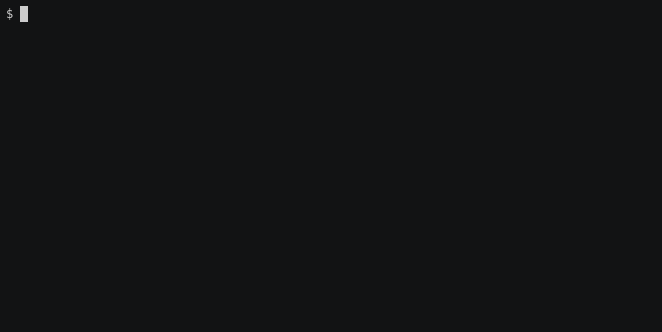

# dab

[](https://github.com/cardano-foundation/dab/actions/workflows/ci.yaml)


<br/>

<p align="center">Decentralized applicaton backend for Cardano.</p>
<p align="center">
  <a href="#about">About</a> •
  <a href="#installation">Installation</a> •
  <a href="#usage">Usage</a> •
  <a href="#contributing">Contributing</a>
</p>

<br/>

# About

Decentralized application backend (dab) is a toolset that help developers interact with the Cardano blockchain and its smart validators.

At its core, the component called `chain-watcher` is following the chain looking for specific events expected by the application backend. It supports different providers to access the Cardano network, at the moment <a href="https://blockfrost.io/">Blockfrost</a>, with other such as Ogmios or Oura planned. 

# Installation

## Building with Nix

Nix is the prefered way to build the chain-watcher and its components.

```command
nix-build -A chain-watcher.components.exes.chain-watcher-blockfrost
```

# Usage

## Running the application backend demo

To run the application backend demo :zap:, do the following:

```command
nix-shell
export BLOCKFROST_TOKEN_PATH=~/.blockfrost.testnet.token
cabal run chain-watcher-blockfrost
```
View the demo on http://localhost:8282/demo/index.html

## Demo of demo



## Client API

### Register new client

To register a new client on the chain-watcher.

```command
curl -X POST -v localhost:8282/clients/new
$ "cf7f8e9e-36af-476a-ba83-60cb4ac17597"

cid="cf7f8e9e-36af-476a-ba83-60cb4ac17597"
```

### Remove client

To remove an exising client on the chain-watcher.

```command
curl -X POST -v localhost:8282/clients/remove/${cid}
```

### Subscribe to event

To subscribe your client to a specific event on the chain-watcher.

```command
curl -X POST --data '{"tag": "Ping"}' -H "Content-Type: application/json" -v localhost:8282/clients/request/${cid}
```

### Recurring request

To subscribe your client to a reoccuring specific event on the chain-watcher.

```command
curl -X POST --data '{"contents":{"tag":"Ping"},"tag":"Recurring"}' -H "Content-Type: application/json" -v localhost:8282/clients/request/${cid}
```

### Address change request

To change your address event watching.

```command
curl -X POST --data '{"contents":"addr_test1wpzjtlyp6v4qx6gzjm4zc7lsdufw597507y060qhk84vpjsjd625n","tag":"AddressFundsRequest"}' -H "Content-Type: application/json" -v localhost:8282/clients/request/${cid}
```

### Follow server-sent event stream

To follow on the even stream from the chain-watcher.

```command
curl -v -N --http2 -H "Accept:text/event-stream" localhost:8282/sse/${cid}
```

# Contributing

We are looking forward to your contributions!

:bulb: See <a href="CODE_OF_CONDUCT.md">CODE_OF_CONDUCT</a> for more information about of code of conduct for contributors.


